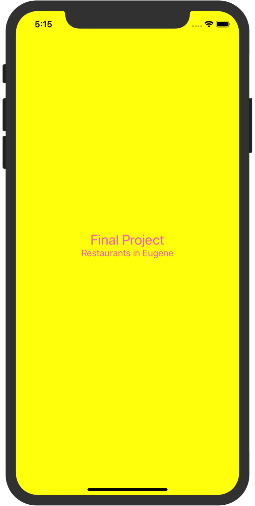

# IOS-Local-Restaurant

## Starting Page

* starting page follow by log in system

## User System

* Log in

* Register

* Support selfie upload and special character typing

* User Account management system

* Not support funtion of switch selfie

## Restuarnt 

* Category for different types of Restaurant and SearchBar Supported

* ABC... Section Name find supported

* Specific Restaurant Informations

* SearchBar Supported

* Dish name and price indicated

* SearchBar Supported

## Comment Module

* Support live communication among people who wish to rate the restaurant. Backend database is Firebase

