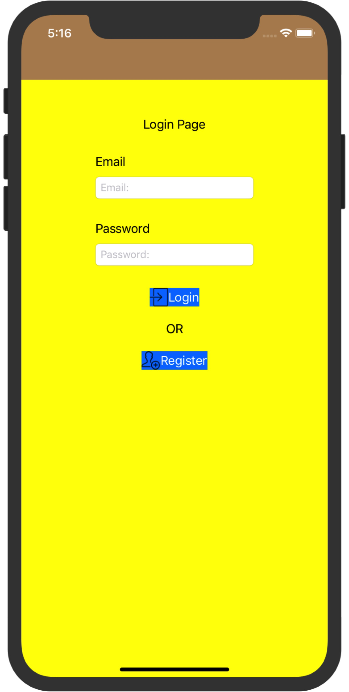
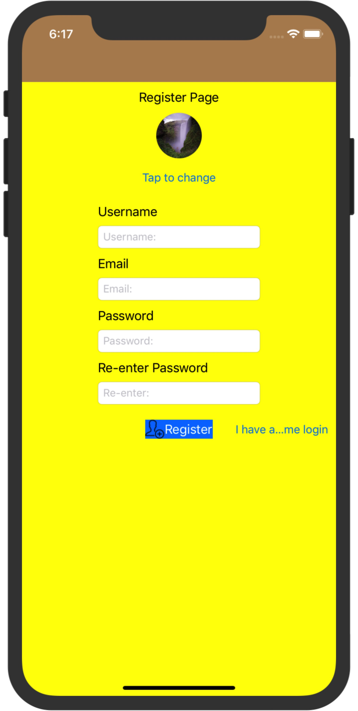
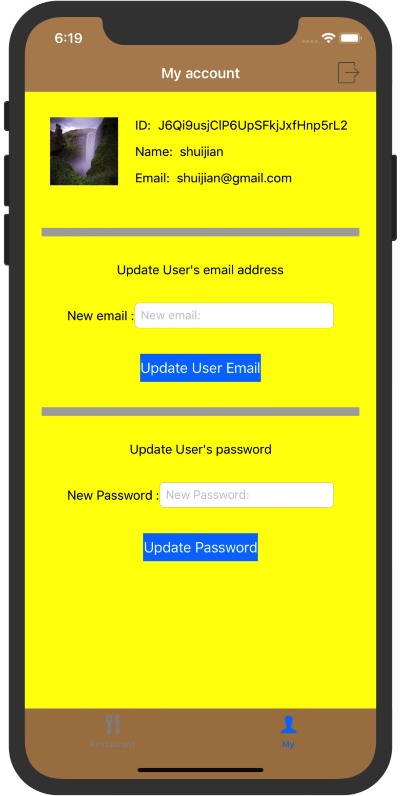
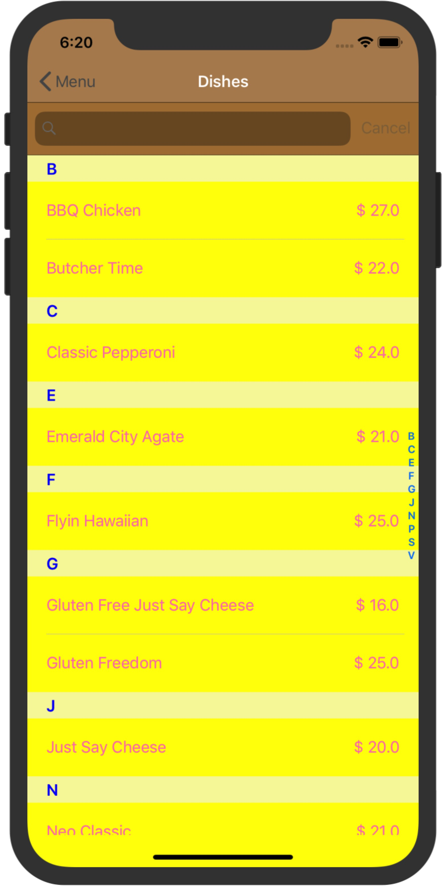
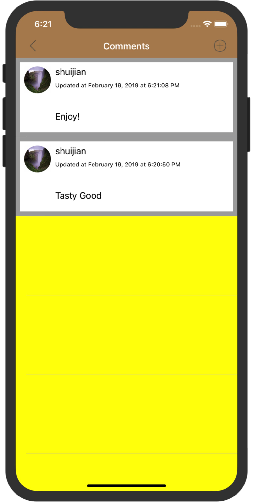

# IOS-Local-Restaurant

Developing an IOS App which allows live communication among people who registered a account in the Firebase database. 

### Starting Page

* starting page follow by log in system

### User System

{:height="50%" width="50%"}

* Log in

{:height="50%" width="50%"}

* Register

{:height="50%" width="50%"}

* User Account management system

### Restuarnt 

{:height="50%" width="50%"}

* Category for different types of Restaurant and SearchBar Supported

{:height="50%" width="50%"}

* Specific Restaurant Informations

{:height="50%" width="50%"}

* Dish name and price indicated

### Comment Module

* My App support live communication among people who wish to rate the restaurant.

{:height="50%" width="50%"}

